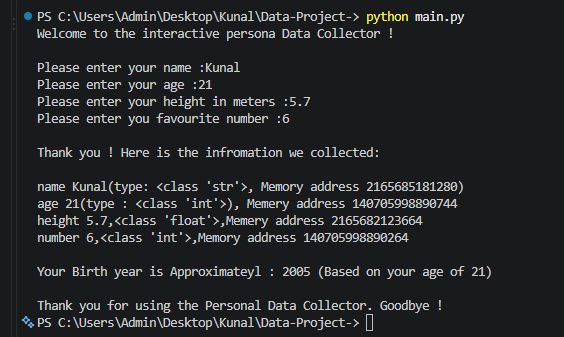

# 🧑‍💻 Personal Data collector 

 ## 📌 1. Project Title

 **🧑‍💻 Interactive Personal Data Collector**

 A simple 🐍 Python-based interactive program that collects basic personal information from the user and displays the collected data along with its data type and memory address.

 ## 📝 2. Project Description

 The **Interactive Personal Data Collector** is a beginner-friendly 🐍 Python project designed to demonstrate how Python handles:

 - 👤 User input
- 📦 Variables
- 🔤 Data types
- 🧠 Memory addresses
- 🧮 Basic calculations

 The program asks the user to enter:

 - 👤 Name
- 🎂 Age
- 📏 Height in meters
- ⭐ Favourite number

 After collecting the information, the program displays the entered values, their Python data types, and their memory addresses using Python's built-in `id()` function.

 It also calculates an approximate 📅 birth year based on the user's age.

 ## ✨ 3. Features

 - 💬 Interactive command-line interface.
- 👤 Collects the user's name.
- 🎂 Collects the user's age.
- 📏 Collects the user's height.
- ⭐ Collects the user's favourite number.
- 🔤 Displays the data type of each variable.
- 🧠 Displays the memory address of each variable using `id()`.
- 📅 Calculates an approximate birth year.
- 👋 Provides a simple and friendly goodbye message.

 ## 🛠️ 4. Technologies Used

 - 🐍 **Python 3**
- ⌨️ Python built-in `input()` function
- 🖨️ Python built-in `print()` function
- 🔍 Python `type()` function
- 🧠 Python `id()` function
- 📝 **f-strings** for formatted output

 📦 **No external libraries or packages are required.**

 ## 🚀 5. How to Run / Installation

 ### 📋 Prerequisites

 Make sure 🐍 **Python 3** is installed on your computer.

 Check your Python installation by running:

```
python --version
```

 or:

```
python3 --version
```

 ### 📥 Installation

 1. 📦 Download or clone this project.
2. 📂 Open the project folder in a terminal or command prompt.
3. ▶️ Run the Python file.

 If your Python file is named `main.py`:

```
python main.py
```

 On some systems, use:

```
python3 main.py
```

 ### ▶️ Usage

 The program will ask you to enter your personal information:

```
👤 Please enter your name:
🎂 Please enter your age:
📏 Please enter your height in meters:
⭐ Please enter your favourite number:
```

 Enter the requested information, and the program will display the collected data.

 ## 📂 6. Project Structure

```
├── 📸 output.png
├── 🐍 main.py
└── 📖 README.md
```

 ### 📄 File Description

 | 📁 File | 📋 Description |
| --- | --- |
| 🐍 `main.py` | Main Python program containing the data collection logic |
| 📖 `README.md` | Project documentation |

## 📸 7. Output / Screenshots


     

 ## 👨‍💻 8. Author / Developer Name

 **👤 Name:** Kunal Vaghela**

